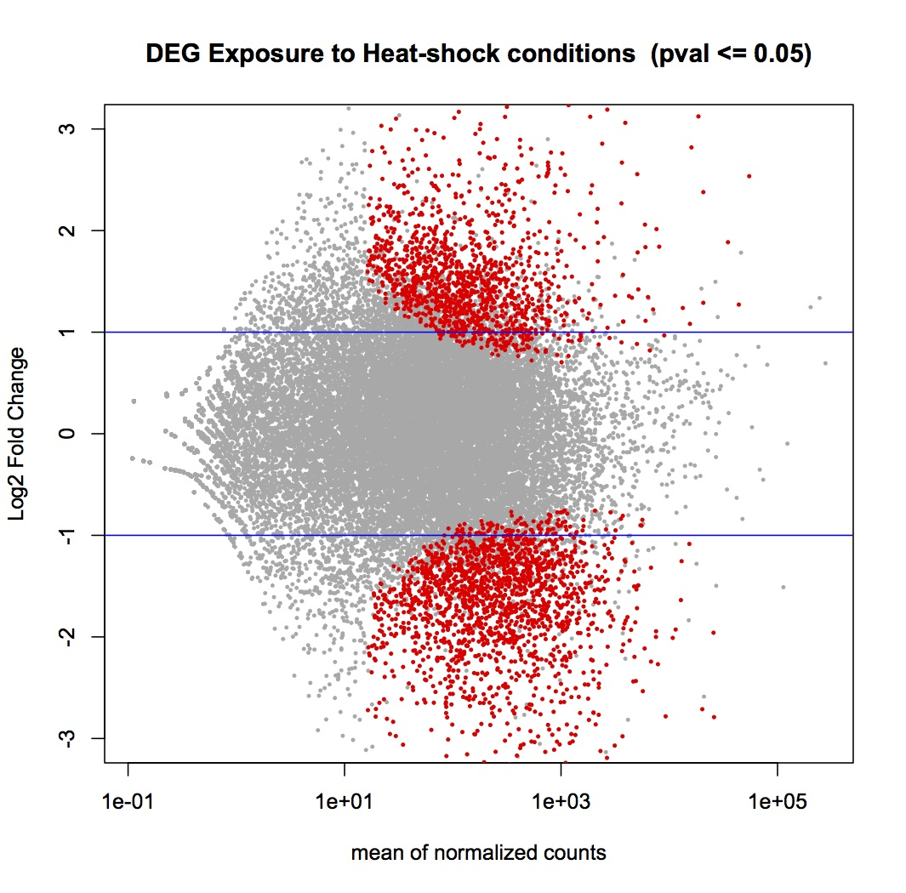

# Notes from ASI course activites
---

## Oyster DESeq experiment


---

### 1. Getting started. You must have:
* R Console (download from <http://www.r-project.org>)
* Reads count table from RNA-seq experiment
* DESeq program in R console

### 2. Obtaining DESeq in R console
* Enter to R console and type:

````
#source("http://bioconductor.org/biocLite.R")
#biocLite("DESeq2")
````
### 3. Prepare your data 
* Assign a library to DESeq in R console

````
data <- read.table("./data/Cgigas-HS-count.txt", header = T, sep = "\t")
rownames(data) <- data$Feature
data <- data[,-1]
````
* Specify which columns are in which groups


````
deseq2.colData <- data.frame(condition=factor(c(rep("Control", 3), rep("Heat-shock", 3))), 
    type=factor(rep("single-read", 6)))
	rownames(deseq2.colData) <- colnames(data)
	deseq2.dds <- DESeqDataSetFromMatrix(countData = data,
    colData = deseq2.colData, 
    design = ~ condition)
````

### 4. Run the analysis
* Run DESeq in R console

````
deseq2.dds <- DESeq(deseq2.dds)
deseq2.res <- results(deseq2.dds)
deseq2.res <- deseq2.res[order(rownames(deseq2.res)), ]
````

* You will receive some messages while console is running, then you can see the results typing:

````
head(deseq2.res)
````

* Then you can adjust statistically signifcant differences, and count the signicantly expressed contigs, by providing p-value threshold:

```
dim(deseq2.res[!is.na(deseq2.res$padj) & deseq2.res$padj <= 0.05, ])
````


### 5. Plot the obtained results
* Make a plot in the R console 

````
tmp <- deseq2.res
````

* Stablish the axis, title and colours

````
plot(tmp$baseMean, tmp$log2FoldChange, pch=20, cex=0.45, ylim=c(-3, 3), log="x", col="darkgray",
     main="DEG Exposure to Heat shocks  (pval <= 0.05)",
     xlab="mean of normalized counts",
     ylab="Log2 Fold Change")
````

* Select the significant values in the plot

````
tmp.sig <- deseq2.res[!is.na(deseq2.res$padj) & deseq2.res$padj <= 0.05, ]
points(tmp.sig$baseMean, tmp.sig$log2FoldChange, pch=20, cex=0.45, col="red")
````

* Make 2 FC lines

````
abline(h=c(-1,1), col="blue")
````



### 6. Exporting significant values

* Write a table with the significantly expressed contigs

````
write.table(tmp.sig, "./wd/Oyster_DESeq.tab", row.names = T)
````
* You can preview the table

````
!head ./wd/Phel_DEGlist.tab
````

## Please download the files at the "output" directory. Also you can download the R console script in the "scripts" folder.


                                    
